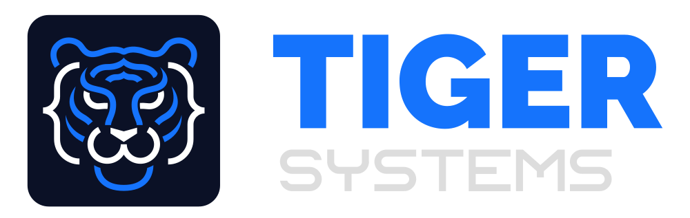

# 🚀 Tiger Systems - Soluciones de Software & Inteligencia Artificial

Plataforma web corporativa y de captación de clientes de **Tiger Systems**, diseñada bajo estándares de ingeniería de software de alto rendimiento, estética *cyber-tech* moderna e integración de canales de conversión directa hacia WhatsApp.



---

## 🌟 Características Principales

- **Hero Banner de Alto Impacto**: Titular con efecto metálico animado (*shimmer text*), propuesta de valor clara y llamadas a la acción duales hacia cotización y demo interactiva.
- **Franja de Métricas y Prueba Social**: Indicadores de disponibilidad en la nube (+99.8%), atención continua 24/7, reducción de tiempos operativos y propiedad total del código fuente.
- **Soluciones Tecnológicas a Medida (Servicios)**:
  - **Escritorio**: Barra de pestañas interactiva (*Tabs Showcase*) con transiciones suaves entre especialidades.
  - **Móviles**: **Carrusel táctil horizontal** con aceleración de hardware nativa (`scroll-snap-type`), tarjetas ergonómicas con previsualización de la siguiente diapositiva, botones táctiles y puntos de paginación sincronizados.
- **Simulador de Asistente IA en Vivo**: Interfaz de chat interactiva que emula las capacidades de los agentes autónomos de Tiger Systems con respuestas automáticas preconfiguradas.
- **Metodología en 4 Pasos**: Eliminación de incertidumbre para clientes corporativos (Diagnóstico, Sprint Ágil, QA & Seguridad, Despliegue & Garantía).
- **Cotizador Rápido de Proyectos**: Calculadora interactiva donde el cliente selecciona tipo de plataforma, módulo de IA, plazo de entrega y genera un presupuesto estimado con enlace directo y parametrizado a WhatsApp.
- **Sobre Nosotros con Terminal macOS**: Presentación de la empresa acompañada de una ventana de código interactiva estilo Unix/macOS con resaltado de sintaxis.
- **Preguntas Frecuentes (FAQ Acordeón)**: Respuestas a dudas técnicas, tiempos, garantías y propiedad intelectual.
- **Canal de Conversión Omnipresente**: Botón flotante permanente de WhatsApp con indicador de disponibilidad "En línea" (`+58 424 6072880`).

---

## 🛠️ Stack Tecnológico

- **HTML5 Semántico**: Estructuración accesible (`aria-labels`), metadatos optimizados para SEO y OpenGraph.
- **CSS3 Moderno**: 
  - Paleta cromática oficial de Tiger Systems: Azul Eléctrico (`#1573fc`), Medianoche (`#0b1126`), Cian Tech (`#38bdf8`) y Plata Metalizada (`#dddddd`).
  - Efectos *glassmorphism* con desenfoque de fondo (`backdrop-filter`).
  - Variables CSS (Custom Properties) para arquitectura escalable de diseño.
  - Desplazamiento táctil y snapping sin librerías externas.
- **JavaScript Vanilla (ES6+)**:
  - Manipulación ligera del DOM sin dependencias pesadas.
  - Sincronización pasiva de scroll con `window.requestAnimationFrame`.
  - Simulación de tipeo y respuestas del agente inteligente.
  - Cálculo dinámico de presupuestos en tiempo real.

---

## 📂 Estructura del Proyecto

```text
tiger-systems2.0/
├── img/                  # Logotipos oficiales (SVG) y fondos optimizados
│   ├── logo-full.svg     # Logotipo corporativo completo
│   ├── logo-icon.svg     # Isotipo / Ícono del tigre
│   └── fondo1.2.jpg      # Fondo Hero de alta definición
├── index.html            # Estructura semántica principal
├── styles.css            # Hoja de estilos corporativos y responsive design
├── script.js             # Lógica interactiva, cotizador y asistente IA
├── .gitignore            # Exclusión de archivos de trabajo y temporales
└── README.md             # Documentación técnica del repositorio
```

---

## 💻 Ejecución Local

Para visualizar el proyecto localmente sin necesidad de instalar servidores complejos:

1. **Clonar el repositorio**:
   ```bash
   git clone https://github.com/TU_USUARIO/tiger-systems.git
   cd tiger-systems
   ```

2. **Abrir en el navegador**:
   - Puedes hacer doble clic en `index.html`.
   - O utilizar cualquier servidor estático local (como Live Server en VS Code o `pnpm dlx serve`).

---

## 🚀 Despliegue en Producción

El proyecto está 100% listo para ser desplegado en plataformas estáticas globales de forma gratuita:
- **GitHub Pages**: En la configuración del repositorio (`Settings > Pages`), seleccionar la rama `main` y la carpeta `/root`.
- **Vercel**: Importar el repositorio de GitHub y presionar *Deploy* (cero configuración requerida).
- **Netlify**: Arrastrar la carpeta o conectar mediante GitHub.

---

## 📄 Licencia y Derechos

© 2026 **Tiger Systems**. Todos los derechos reservados.
Desarrollado con pasión, precisión de ingeniería y enfoque en Inteligencia Artificial.